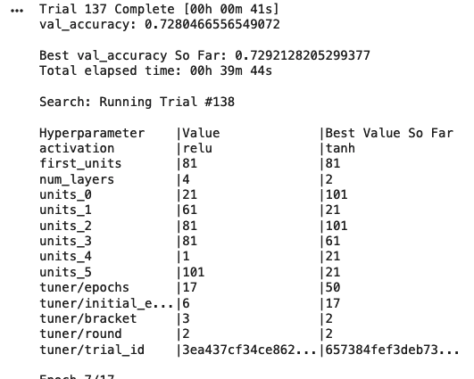

# Neural Network Charity Analysis

## Overview of Analysis
### Purpose
The purpose of this analysis was to use machine learning to create a model that could accurately predict if an applicant would be successful if funded by Alphabet Soup. The provided data looked at over 34,000 organizations that had received funding from Alphabet Soup and tracked several factors such as application type, use case, organization type, etc.

## Results
### Data Preprocessing
- The target or output is whether or not the money was used effectively (IS_SUCCESSFUL).
- The features or inputs are the other variables within the csv:
  -  APPLICATION_TYPE—Alphabet Soup application type
  -  AFFILIATION—Affiliated sector of industry
  -  CLASSIFICATION—Government organization classification
  -  USE_CASE—Use case for funding
  -  ORGANIZATION—Organization type
  -  STATUS—Active status
  -  INCOME_AMT—Income classification
  -  SPECIAL_CONSIDERATIONS—Special consideration for application
  -  ASK_AMT—Funding amount requested
- The variables that are neither targets nor features are NAME and EIN. These columns are just identifiers for organizations. 

### Compiling, Training, and Evaluating the Model.
- The model that was the most accurate, had 2 hidden layers each with 120 neurons. I chose the relu functions for the layers and sigmoid for the output. I chose 120 becuase the module stated that it is best to use 2-3 times as many neurons as inputs and after removing a couple more variables there were 41 inputs. I chose the relu and sigmoid functions because the few tests I did with other functions had lower accuracy and higher loss. 

- I was not able to meat the target model performance. Even with implementing keras-tuner and hyperparameter, I was only able to get a model that had 73% accuracy.
- To increase the model performance, I removed 2 additional columns, status and special_considerations_N. These two variables seemed to cause more confusion since one was redundant and the other only had a small percentage of inactive organizations. I also implemented keras-tuner and hyperparameter to try to find the highest performing model. After over 130 trials, the highest accuracy still did not meat the target model performance. Moving forward I would investigate whether or not any of the other variables were causing too much noise and either bin or remove them.

## Summary
Using neural networks, I was not able to create a deep learning model with performance higher than 73% accuracy. As stated above, moving forward I would investigate whether or not any of the other variables were causing too much noise and either bin or remove them. Additionally, since this analysis is attempting to predict whether a organization is succcessful or not, I would also recommend a logistic regression model. A logistic regression model is a classification algorithm that can analyze continuous and categorical variables. All of the variables fall into these categories and it could be easily tested.
